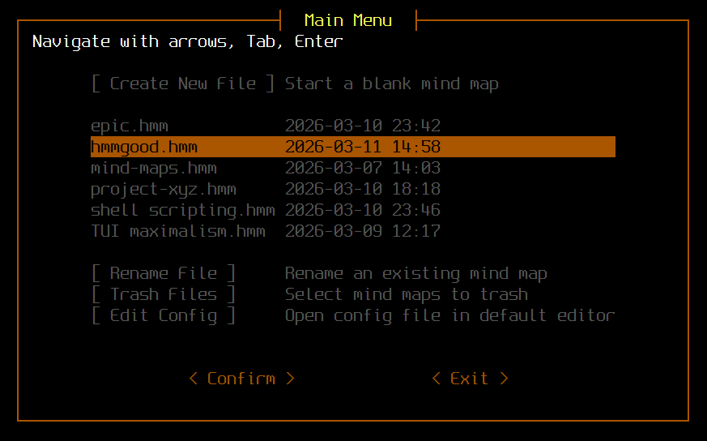

# What is it?
## Menu
A minimalistic TUI menu/launcher for h-m-m mind mapping tool. Thanks to nadrad for creating h-m-m!

## Icon
It comes with a .desktop entry, mime type, and an icon. This integrates hmmgood into a linux system in a standard way. User will now be able to open .hmm files from any file browser.

# Dependencies
- h-m-m https://github.com/nadrad/h-m-m
- whiptail

# Installation
1. install whiptail and h-m-m
2. on linux: clone hmmgood github repo and run install.sh (sudo is not needed)

Alternatively you can copy files manually to appropriate destinations on your system.

Or you can run hmmgood script as is, without installation.

# Behavior
- Navigate menu with arrows, Tab and Enter
- When opened from an application launcher, hmmgood launches in default terminal emulator.
- Hmmgood menu shows all .hmm mind maps located in a specified directory. It is set to `$HOME/.local/share/hmmgood` by default.
- Hmmgood directory can be configured in `hmmgood.conf`
- Both `hmmgood.conf` and `h-m-m.conf` are accessible from the hmmgood menu under [ Edit Config ].
- User can open a mind map from a file browser or by lauching `hmmgood <path/to/my-mind-map.hmm>` from the terminal. In both cases menu will not be shown.
